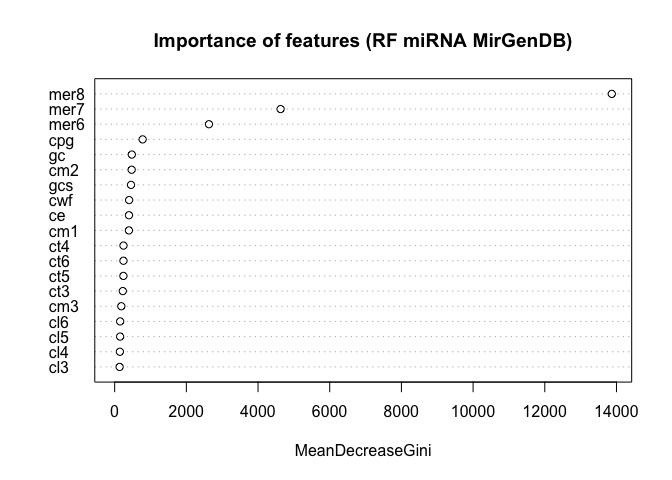

RF miRNAs MirGenDB
================
Carol Moraga
6/9/2022

## Load libraries

``` r
#install.packages("randomForest")
#install.packages("caret")
#install.packages("e1071")
#install.packages("caTools")
library(randomForest)
```

    ## randomForest 4.7-1.1

    ## Type rfNews() to see new features/changes/bug fixes.

``` r
library(caret)
```

    ## Loading required package: ggplot2

    ## 
    ## Attaching package: 'ggplot2'

    ## The following object is masked from 'package:randomForest':
    ## 
    ##     margin

    ## Loading required package: lattice

``` r
library(e1071)
library(caTools)
```

## Prepare training data

We use the data from MirGenDB database to train 15-mers vs random
15-mers along with 26 features. Top performance features were selected
by a mimimum GINI index of 100, which let us with a total of 19 features
to discriminate miRNAs from random 15-mer sequences.

``` r
d=read.table("MirGenDB.rf.training.data",h=T)
d_mi=d[d$type=="miRNA",]
d_mirand=d[d$type!="miRNA",]
#cmodel=c("gc","gcs","cpg","cwf","ce",
#        "cm1","cm2","cm3","cm4","cm5",
#        "cm6","ct1","ct2","ct3","ct4",
#        "ct5","ct6","cl1","cl2","cl3",
#        "cl4","cl5", "cl6", "mer6", "mer7", "mer8")

#Gini > 100
# a > 100
#      Overall
# gc      TRUE
# gcs     TRUE
# cpg     TRUE
# cwf     TRUE
# ce      TRUE
# cm1     TRUE
# cm2     TRUE
# cm3     TRUE
# cm4    FALSE
# cm5    FALSE
# cm6    FALSE
# ct1    FALSE
# ct2    FALSE
# ct3     TRUE
# ct4     TRUE
# ct5     TRUE
# ct6     TRUE
# cl1    FALSE
# cl2    FALSE
# cl3     TRUE
# cl4     TRUE
# cl5     TRUE
# cl6     TRUE
# mer6    TRUE
# mer7    TRUE
# mer8    TRUE

cmodel=c("gc","gcs","cpg","cwf","ce",
        "cm1","cm2","cm3","ct3","ct4",
        "ct5","ct6","cl3","cl4","cl5", 
        "cl6", "mer6", "mer7", "mer8")

d_mi=d_mi[,cmodel]
d_mi$miRNA=1
d_mirand=d_mirand[,cmodel]
d_mirand$miRNA=0
#we convert to factor
d_mi$miRNA=as.factor(d_mi$miRNA)
d_mirand$miRNA=as.factor(d_mirand$miRNA)
```

We split the data intro training and test

``` r
#we split the data into trainin and test
d_mirand=d_mirand[sample(nrow(d_mirand), dim(d_mi)*1),]
dim(d_mirand)
```

    ## [1] 35570    20

``` r
dim(d_mi)
```

    ## [1] 35570    20

``` r
mi_data=rbind(d_mi,d_mirand)
head(mi_data)
```

    ##          gc       gcs cpg      cwf       ce       cm1       cm2       cm3
    ## 1 0.3333333 0.6000000   0 1.733947 1.806239 0.9031195 0.8089816 0.5910989
    ## 2 0.4666667 0.1428571   0 1.700613 1.989898 0.9949490 0.8312157 0.6167400
    ## 3 0.4666667 0.7142857   0 1.747781 1.705587 0.8527936 0.7597872 0.5910989
    ## 4 0.4666667 0.1428571   0 1.700613 1.989898 0.9949490 0.7240729 0.5398169
    ## 5 0.3333333 0.6000000   0 1.733947 1.806239 0.9031195 0.7105927 0.6167400
    ## 6 0.4000000 0.3333333   0 1.726533 1.796792 0.8983958 0.7820213 0.5910989
    ##         ct3       ct4       ct5       ct6       cl3       cl4       cl5
    ## 1 0.6593407 0.6593407 0.6593407 0.6593407 0.8387097 0.8837209 0.9074074
    ## 2 0.7857143 0.7857143 0.7857143 0.7857143 0.9032258 0.9302326 0.9444444
    ## 3 0.5934066 0.5934066 0.5934066 0.5934066 0.8064516 0.8604651 0.8888889
    ## 4 0.4395604 0.4029304 0.4029304 0.4029304 0.7096774 0.7674419 0.8148148
    ## 5 0.5714286 0.5714286 0.5714286 0.5714286 0.8064516 0.8604651 0.8888889
    ## 6 0.6593407 0.6593407 0.6593407 0.6593407 0.8387097 0.8837209 0.9074074
    ##        cl6 mer6 mer7 mer8 miRNA
    ## 1 0.921875  981  244   61     1
    ## 2 0.953125 1225  272   89     1
    ## 3 0.906250  958  185   71     1
    ## 4 0.843750 1927  589  177     1
    ## 5 0.906250 1133  330  122     1
    ## 6 0.921875 1358  368  131     1

``` r
sapply(mi_data, class)
```

    ##        gc       gcs       cpg       cwf        ce       cm1       cm2       cm3 
    ## "numeric" "numeric" "numeric" "numeric" "numeric" "numeric" "numeric" "numeric" 
    ##       ct3       ct4       ct5       ct6       cl3       cl4       cl5       cl6 
    ## "numeric" "numeric" "numeric" "numeric" "numeric" "numeric" "numeric" "numeric" 
    ##      mer6      mer7      mer8     miRNA 
    ## "integer" "integer" "integer"  "factor"

``` r
df <- mi_data
```

We split the data into 75% for training and 25% for evaluation

``` r
#we split the data for testing and evaluation
sample = sample.split(df$miRNA, SplitRatio = 0.75)
train = subset(df, sample == TRUE) # 75% training
test  = subset(df, sample == FALSE) # 25% for evaluation
# fitting datasset to avoid overfitting.
dim(train)
```

    ## [1] 53356    20

``` r
dim(test)
```

    ## [1] 17784    20

## Random Forest

### Training

``` r
#test with regular training 
rf <- randomForest(
  miRNA ~ .,
  #importance=T,
  data=train,
  keep.forest = TRUE
)
```

### Evaluation

``` r
#we make the predictions
pred = predict(rf, newdata=test)
#we evaluate the prediction
confusionMatrix(pred, test$miRNA)
```

    ## Confusion Matrix and Statistics
    ## 
    ##           Reference
    ## Prediction    1    0
    ##          1 8342 1251
    ##          0  550 7641
    ##                                           
    ##                Accuracy : 0.8987          
    ##                  95% CI : (0.8942, 0.9031)
    ##     No Information Rate : 0.5             
    ##     P-Value [Acc > NIR] : < 2.2e-16       
    ##                                           
    ##                   Kappa : 0.7975          
    ##                                           
    ##  Mcnemar's Test P-Value : < 2.2e-16       
    ##                                           
    ##             Sensitivity : 0.9381          
    ##             Specificity : 0.8593          
    ##          Pos Pred Value : 0.8696          
    ##          Neg Pred Value : 0.9329          
    ##              Prevalence : 0.5000          
    ##          Detection Rate : 0.4691          
    ##    Detection Prevalence : 0.5394          
    ##       Balanced Accuracy : 0.8987          
    ##                                           
    ##        'Positive' Class : 1               
    ## 

``` r
varImp(rf)
```

    ##         Overall
    ## gc     478.6378
    ## gcs    456.0149
    ## cpg    780.3036
    ## cwf    403.5648
    ## ce     399.0713
    ## cm1    397.8033
    ## cm2    474.4141
    ## cm3    185.9199
    ## ct3    227.5188
    ## ct4    246.2067
    ## ct5    243.5388
    ## ct6    245.5288
    ## cl3    137.9474
    ## cl4    145.6713
    ## cl5    152.5678
    ## cl6    153.9868
    ## mer6  2631.0933
    ## mer7  4628.9708
    ## mer8 13869.4331

``` r
varImpPlot(rf,main="Importance of features (RF miRNA MirGenDB)")
```

<!-- -->

### Training with all data

``` r
#test with regular training 
rff <- randomForest(
 miRNA ~ .,
 #importance=T,
data=mi_data,
keep.forest = TRUE
)

cat('Model build complete. Saving model...\n')
```

    ## Model build complete. Saving model...

``` r
saveRDS(rff, file="MirGenDB_rf_model_v01.rds")
cat('Model data saved.\n')
```

    ## Model data saved.

``` r
save.image(file=paste0("MirGenDB_rf_model_v01",".RData"))
```

<!-- ## Classification of Brumir results -->
<!-- ```{r loadbrumirdata} -->
<!-- br=read.table("Git/BrumiR/random_forest/test2.br",h=T) -->
<!-- br$miRNA=0 -->
<!-- #we convert to factor -->
<!-- br$miRNA=as.factor(br$miRNA) -->
<!-- sample.features<-subset(br, select = names(rff$forest$xlevels)) -->
<!-- any.missing.features <- which(!names(rff$forest$xlevels) %in% colnames(sample.features)); -->
<!-- #we predict using the model -->
<!-- predicted.class <- predict(rff, sample.features)  -->
<!-- predicted.prob <- predict(rff, sample.features, type="prob") -->
<!-- predictions <- data.frame( -->
<!--   br, -->
<!--   Predicted.Class = predicted.class, -->
<!--   Predicted.prob = predicted.prob -->
<!-- )   -->
<!-- write.table( -->
<!--   x = predictions, -->
<!--   file = paste0("brumir", "_predictions_unfiltered2.txt"), -->
<!--   sep = '\t', -->
<!--   row.names = TRUE, -->
<!--   quote = FALSE -->
<!-- ); -->
<!-- a=predictions[predictions$Predicted.prob.1 > 0.8,] -->
<!-- #write the filtered predictions -->
<!-- write.table( -->
<!--   x = a, -->
<!--   file = paste0("brumir", "_predictions_filtered2.txt"), -->
<!--   sep = '\t', -->
<!--   row.names = TRUE, -->
<!--   quote = FALSE -->
<!-- ); -->
<!-- ``` -->

## R session info

print the session information.

``` r
devtools::session_info()
```

    ## ─ Session info ───────────────────────────────────────────────────────────────
    ##  setting  value
    ##  version  R version 4.1.2 (2021-11-01)
    ##  os       macOS Big Sur 10.16
    ##  system   x86_64, darwin17.0
    ##  ui       X11
    ##  language (EN)
    ##  collate  en_US.UTF-8
    ##  ctype    en_US.UTF-8
    ##  tz       America/Santiago
    ##  date     2022-07-11
    ##  pandoc   2.14.0.3 @ /Applications/RStudio.app/Contents/MacOS/pandoc/ (via rmarkdown)
    ## 
    ## ─ Packages ───────────────────────────────────────────────────────────────────
    ##  package      * version    date (UTC) lib source
    ##  assertthat     0.2.1      2019-03-21 [1] CRAN (R 4.1.0)
    ##  bitops         1.0-7      2021-04-24 [1] CRAN (R 4.1.0)
    ##  brio           1.1.3      2021-11-30 [1] CRAN (R 4.1.0)
    ##  cachem         1.0.6      2021-08-19 [1] CRAN (R 4.1.0)
    ##  callr          3.7.0      2021-04-20 [1] CRAN (R 4.1.0)
    ##  caret        * 6.0-92     2022-04-19 [1] CRAN (R 4.1.2)
    ##  caTools      * 1.18.2     2021-03-28 [1] CRAN (R 4.1.0)
    ##  class          7.3-19     2021-05-03 [1] CRAN (R 4.1.2)
    ##  cli            3.3.0      2022-04-25 [1] CRAN (R 4.1.2)
    ##  codetools      0.2-18     2020-11-04 [1] CRAN (R 4.1.2)
    ##  colorspace     2.0-2      2021-06-24 [1] CRAN (R 4.1.0)
    ##  crayon         1.4.2      2021-10-29 [1] CRAN (R 4.1.0)
    ##  data.table     1.14.2     2021-09-27 [1] CRAN (R 4.1.0)
    ##  DBI            1.1.2      2021-12-20 [1] CRAN (R 4.1.0)
    ##  desc           1.4.1      2022-03-06 [1] CRAN (R 4.1.2)
    ##  devtools       2.4.3      2021-11-30 [1] CRAN (R 4.1.0)
    ##  digest         0.6.29     2021-12-01 [1] CRAN (R 4.1.0)
    ##  dplyr          1.0.7      2021-06-18 [1] CRAN (R 4.1.0)
    ##  e1071        * 1.7-11     2022-06-07 [1] CRAN (R 4.1.2)
    ##  ellipsis       0.3.2      2021-04-29 [1] CRAN (R 4.1.0)
    ##  evaluate       0.14       2019-05-28 [1] CRAN (R 4.1.0)
    ##  fansi          1.0.2      2022-01-14 [1] CRAN (R 4.1.2)
    ##  fastmap        1.1.0      2021-01-25 [1] CRAN (R 4.1.0)
    ##  foreach        1.5.2      2022-02-02 [1] CRAN (R 4.1.2)
    ##  fs             1.5.2      2021-12-08 [1] CRAN (R 4.1.0)
    ##  future         1.26.1     2022-05-27 [1] CRAN (R 4.1.2)
    ##  future.apply   1.9.0      2022-04-25 [1] CRAN (R 4.1.2)
    ##  generics       0.1.2      2022-01-31 [1] CRAN (R 4.1.2)
    ##  ggplot2      * 3.3.5      2021-06-25 [1] CRAN (R 4.1.0)
    ##  globals        0.15.1     2022-06-24 [1] CRAN (R 4.1.2)
    ##  glue           1.6.2      2022-02-24 [1] CRAN (R 4.1.2)
    ##  gower          1.0.0      2022-02-03 [1] CRAN (R 4.1.2)
    ##  gtable         0.3.0      2019-03-25 [1] CRAN (R 4.1.0)
    ##  hardhat        1.2.0      2022-06-30 [1] CRAN (R 4.1.2)
    ##  highr          0.9        2021-04-16 [1] CRAN (R 4.1.0)
    ##  htmltools      0.5.2      2021-08-25 [1] CRAN (R 4.1.0)
    ##  ipred          0.9-13     2022-06-02 [1] CRAN (R 4.1.2)
    ##  iterators      1.0.14     2022-02-05 [1] CRAN (R 4.1.2)
    ##  knitr          1.37       2021-12-16 [1] CRAN (R 4.1.0)
    ##  lattice      * 0.20-45    2021-09-22 [1] CRAN (R 4.1.2)
    ##  lava           1.6.10     2021-09-02 [1] CRAN (R 4.1.0)
    ##  lifecycle      1.0.1      2021-09-24 [1] CRAN (R 4.1.0)
    ##  listenv        0.8.0      2019-12-05 [1] CRAN (R 4.1.0)
    ##  lubridate      1.8.0      2021-10-07 [1] CRAN (R 4.1.0)
    ##  magrittr       2.0.2      2022-01-26 [1] CRAN (R 4.1.2)
    ##  MASS           7.3-54     2021-05-03 [1] CRAN (R 4.1.2)
    ##  Matrix         1.3-4      2021-06-01 [1] CRAN (R 4.1.2)
    ##  memoise        2.0.1      2021-11-26 [1] CRAN (R 4.1.0)
    ##  ModelMetrics   1.2.2.2    2020-03-17 [1] CRAN (R 4.1.0)
    ##  munsell        0.5.0      2018-06-12 [1] CRAN (R 4.1.0)
    ##  nlme           3.1-153    2021-09-07 [1] CRAN (R 4.1.2)
    ##  nnet           7.3-16     2021-05-03 [1] CRAN (R 4.1.2)
    ##  parallelly     1.32.0     2022-06-07 [1] CRAN (R 4.1.2)
    ##  pillar         1.7.0      2022-02-01 [1] CRAN (R 4.1.2)
    ##  pkgbuild       1.3.1      2021-12-20 [1] CRAN (R 4.1.0)
    ##  pkgconfig      2.0.3      2019-09-22 [1] CRAN (R 4.1.0)
    ##  pkgload        1.2.4      2021-11-30 [1] CRAN (R 4.1.0)
    ##  plyr           1.8.7      2022-03-24 [1] CRAN (R 4.1.2)
    ##  prettyunits    1.1.1      2020-01-24 [1] CRAN (R 4.1.0)
    ##  pROC           1.18.0     2021-09-03 [1] CRAN (R 4.1.0)
    ##  processx       3.5.2      2021-04-30 [1] CRAN (R 4.1.0)
    ##  prodlim        2019.11.13 2019-11-17 [1] CRAN (R 4.1.0)
    ##  proxy          0.4-27     2022-06-09 [1] CRAN (R 4.1.2)
    ##  ps             1.6.0      2021-02-28 [1] CRAN (R 4.1.0)
    ##  purrr          0.3.4      2020-04-17 [1] CRAN (R 4.1.0)
    ##  R6             2.5.1      2021-08-19 [1] CRAN (R 4.1.0)
    ##  randomForest * 4.7-1.1    2022-05-23 [1] CRAN (R 4.1.2)
    ##  Rcpp           1.0.8      2022-01-13 [1] CRAN (R 4.1.2)
    ##  recipes        1.0.1      2022-07-07 [1] CRAN (R 4.1.2)
    ##  remotes        2.4.2      2021-11-30 [1] CRAN (R 4.1.0)
    ##  reshape2       1.4.4      2020-04-09 [1] CRAN (R 4.1.0)
    ##  rlang          1.0.3      2022-06-27 [1] CRAN (R 4.1.2)
    ##  rmarkdown      2.11       2021-09-14 [1] CRAN (R 4.1.0)
    ##  rpart          4.1-15     2019-04-12 [1] CRAN (R 4.1.2)
    ##  rprojroot      2.0.2      2020-11-15 [1] CRAN (R 4.1.0)
    ##  rstudioapi     0.13       2020-11-12 [1] CRAN (R 4.1.0)
    ##  scales         1.1.1      2020-05-11 [1] CRAN (R 4.1.0)
    ##  sessioninfo    1.2.2      2021-12-06 [1] CRAN (R 4.1.0)
    ##  stringi        1.7.6      2021-11-29 [1] CRAN (R 4.1.0)
    ##  stringr        1.4.0      2019-02-10 [1] CRAN (R 4.1.0)
    ##  survival       3.2-13     2021-08-24 [1] CRAN (R 4.1.2)
    ##  testthat       3.1.2      2022-01-20 [1] CRAN (R 4.1.2)
    ##  tibble         3.1.7      2022-05-03 [1] CRAN (R 4.1.2)
    ##  tidyselect     1.1.2      2022-02-21 [1] CRAN (R 4.1.2)
    ##  timeDate       3043.102   2018-02-21 [1] CRAN (R 4.1.0)
    ##  usethis        2.1.5      2021-12-09 [1] CRAN (R 4.1.0)
    ##  utf8           1.2.2      2021-07-24 [1] CRAN (R 4.1.0)
    ##  vctrs          0.4.1      2022-04-13 [1] CRAN (R 4.1.2)
    ##  withr          2.4.3      2021-11-30 [1] CRAN (R 4.1.0)
    ##  xfun           0.29       2021-12-14 [1] CRAN (R 4.1.0)
    ##  yaml           2.2.2      2022-01-25 [1] CRAN (R 4.1.2)
    ## 
    ##  [1] /Library/Frameworks/R.framework/Versions/4.1/Resources/library
    ## 
    ## ──────────────────────────────────────────────────────────────────────────────
